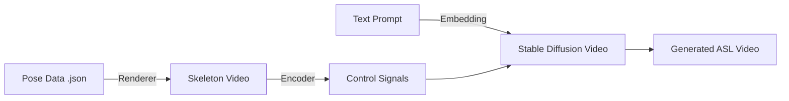

# Phase 3: Recognition & Generative Model

> **GSD Phase**: PLAN → EXECUTE → VERIFY

## Objective

Develop a custom generative pipeline ("SignViP-Lite") to create photorealistic ASL videos from skeletal pose data, and prepare for on-device recognition integration.

---

## Architecture: SignViP-Lite

Instead of training a massive end-to-end model from scratch, we will use a **ControlNet-inspired approach** leveraging existing Stable Diffusion Video priors.



**Key Components:**
1.  **Pose Renderer**: Converts our JSON pose data into a visual "skeleton map" (colored lines for bones) that the model can understand.
2.  **Generative Model**: A diffusion model (likely based on SVD or AnimateDiff) fine-tuned to condition on these skeleton maps.
3.  **Training Loop**: A pipeline to train this adapter using the WLASL dataset (Video + Pose pairs).

---

## Tasks Breakdown

### 3.1 Pose Extraction Pipeline `[paramne-pose]` ✅
- [x] Create independent `paramne-pose-pipeline` project
- [x] Implement MediaPipe extraction script
- [x] Verify on sample video

### 3.2 Generative Model Prototyping `[gen-proto]`
- [ ] **3.2.1 Project Setup**
    - [ ] Create `paramne-generative-prototype` project
    - [ ] Set up PyTorch/Diffusers environment
- [ ] **3.2.2 Data Pipeline**
    - [ ] Create `SkeletonRenderer` (JSON → RGB Image/Video)
    - [ ] Create `ASLDataset` class (loads Video + aligned Skeleton)
- [ ] **3.2.3 Model Architecture**
    - [ ] Implement ControlNet adapter for video (or use AnimateDiff+ControlNet)
    - [ ] Set up training loop (Accelerator, Logging)
- [ ] **3.2.4 Training & Validation**
    - [ ] Run overfitting test on single batch (sanity check)
    - [ ] Run small-scale training one 10-class subset of WLASL

### 3.3 On-Device Recognition (Future)
- [ ] Set up iOS MediaPipe integration
- [ ] Implement similarity scoring algorithm

---

## Implementation Details (3.2)

**Tech Stack:**
- **Framework**: PyTorch, HuggingFace Diffusers
- **Base Model**: Stable Video Diffusion (SVD) or AnimateDiff
- **Conditioning**: ControlNet (OpenPose style)
- **Data**: WLASL (World Level American Sign Language) dataset

**Project Structure:**
```
paramne-generative-prototype/
├── pyproject.toml
├── src/
│   ├── dataset.py       # WLASL loader
│   ├── render.py        # Skeleton visualizer (from 3.1)
│   ├── model.py         # ControlNet/Adapter def
│   └── train.py         # Training loop
└── scripts/
    └── train_local.py   # Launch script
```

---

## Success Criteria (Prototyping)
- [ ] **Skeleton Rendering**: Can convert a pose JSON sequence into a clean MP4 skeleton animation.
- [ ] **Overfitting**: Model can perfectly memorize and reproduce 1 training video given its skeleton.
- [ ] **Generalization**: Model generates a *plausible* human conducting the sign for an unseen skeleton sequence (hands don't need to be perfect yet, just consistent motion).

## Estimated Effort
- **3.2**: 8-12 hours
